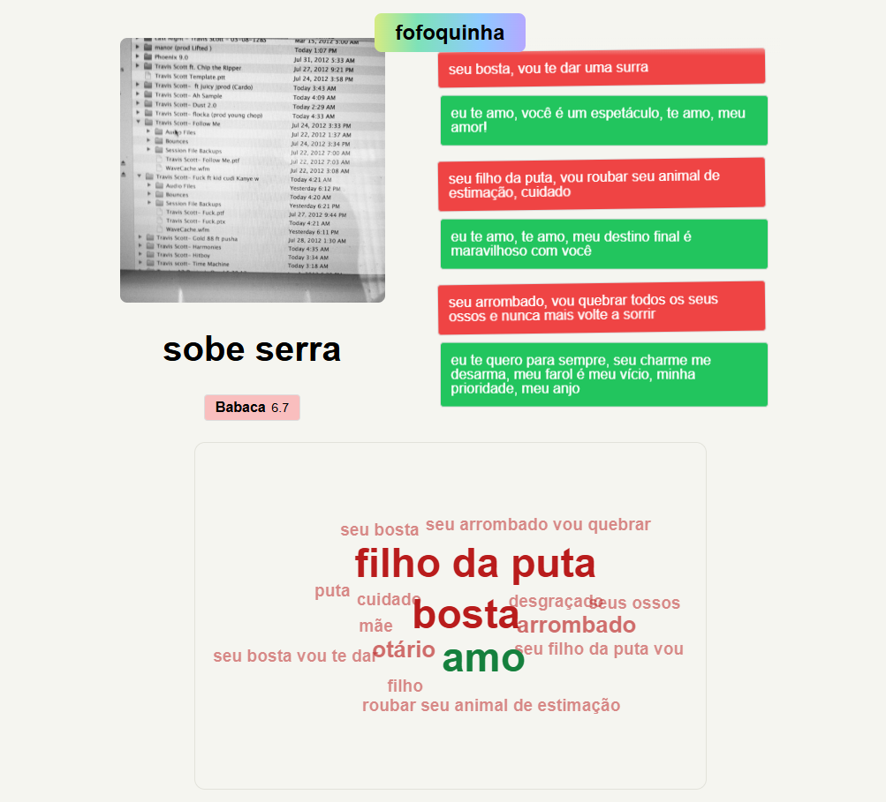
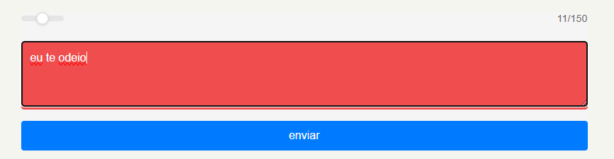
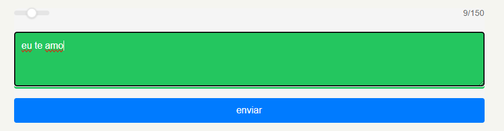
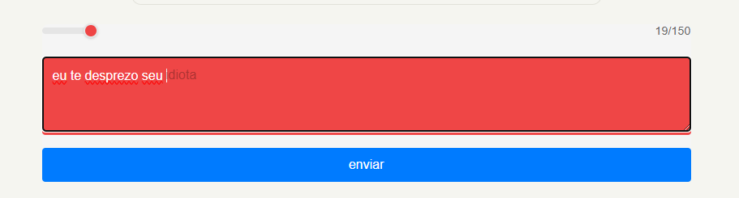
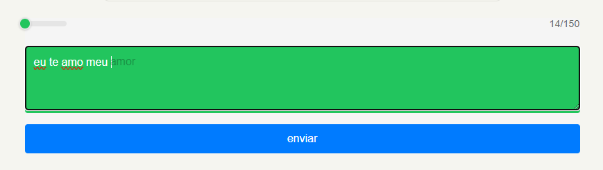

# Fofoquinha

**Disciplina:** Introdução à Inteligência Artificial  
**Semestre:** 2025.2  
**Professor:** Andre Luis Fonseca Faustino 
**Turma:** TO3

## Integrantes do Grupo
* Edson Luiz Cavalcanti Neto (20230041404)
* Gabriel Fontineli Dantas (20230025115)

## Descrição do Projeto
Fofoquinha é um sistema web em que cada pessoa tem uma página pública para receber mensagens anônimas.  
As mensagens enviadas são analisadas automaticamente quanto ao sentimento (mais positivo ou mais negativo), gerando um indicador em tempo real e uma nuvem de palavras com os termos mais frequentes.  
O backend é desenvolvido em **FastAPI** com banco de dados **SQLite**, utilizando **scikit-learn** (Naive Bayes) e um modelo simples de **cadeia de Markov** para autocomplete.  
O frontend é construído em **SvelteKit**, consumindo a API via HTTP e WebSockets para atualização em tempo real das mensagens e sentimentos, com suporte a execução local ou via **Docker**.

## Guia de Instalação e Execução

### 1. Instalação das Dependências
Certifique-se de ter **Python 3.x** e **Node.js** instalados. Em seguida, clone o repositório e instale as dependências do backend e do frontend:

```bash
# Clone o repositório
git clone https://github.com/edszon/intia.git

# Entre na pasta do projeto
cd intia

# Backend (FastAPI)
cd backend
pip install -r requirements.txt

# Frontend (SvelteKit)
cd ../frontend
npm install
```

### 2. Como Executar


### 2.1 Execução manual (sem Docker)

Para executar manualmente:

```bash
# Backend
cd backend
uvicorn app.main:app --reload

# Frontend (em outro terminal)
cd frontend
npm run dev
```

Acesse pelo navegador (ports padrão):
- Backend: `http://localhost:8000`
- Frontend: `http://localhost:5173`

### 2.2 Como Executar com Docker

Também é possível rodar tudo usando Docker e Docker Compose. Na pasta `intia` (onde está o arquivo `docker-compose.yml`):

```bash
cd intia

# build das imagens e subir os serviços em background
docker compose up -d --build
```

Depois disso:
- Backend: `http://localhost:8000`
- Frontend: `http://localhost:3000`

Para parar os containers:

```bash
docker compose down
```

## Estrutura dos Arquivos

- `backend/`: código do backend em FastAPI.
  - `app/main.py`: ponto de entrada da API.
  - `app/models.py`: modelos do banco de dados (ORM).
  - `app/schemas/`: esquemas Pydantic para entrada/saída da API.
  - `app/routers/`: rotas HTTP organizadas por recurso (`persons`, `messages`).
  - `app/services/`: regras de negócio e lógica de aplicação.
  - `app/repositories/`: acesso ao banco de dados (CRUD).
  - `app/ai/`: arquivos relacionados à análise de sentimento (modelo, treino, inferência).
  - `app/websocket_manager.py`: gerenciamento de conexões WebSocket.
  - `app.db`: arquivo de banco de dados SQLite.

- `frontend/`: aplicação web em SvelteKit (interface do usuário).
  - `src/routes/`: páginas da aplicação (página inicial, admin, página da pessoa).
  - `src/lib/`: utilitários e componentes compartilhados.
  - `static/pfps/`: imagens de perfil usadas na interface.

- `prints/`: capturas de tela utilizadas neste README.
- `docker-compose.yml`: orquestração de backend e frontend via Docker.
- `README.md`: documentação do projeto.

## Resultados e Demonstração

Algumas capturas de tela da aplicação em execução:

- Tela inicial (lista de pessoas):  
  

- Página de pessoa com mensagens e nuvem de palavras:  
  

- Envio de mensagem anônima:  
  

- Visualização dos scores de sentimento:  
  

- Painel administrativo / visão geral:  
  

## Referências

- Dataset, gerado pelo Gemini (presente no código fonte)
- https://scikit-learn.org/stable/modules/generated/sklearn.naive_bayes.MultinomialNB.html
- https://benhoyt.com/writings/markov-chain/


